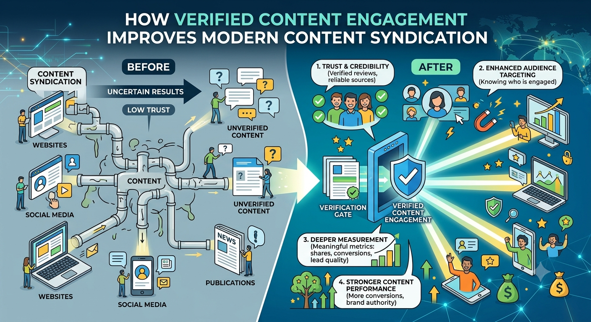
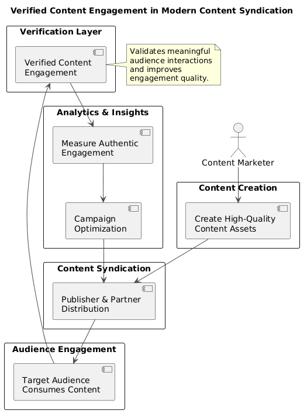

# How Verified Content Engagement Improves Modern Content Syndication

Content syndication has become an essential strategy for organizations that want to extend the reach of valuable content beyond their owned channels. As digital marketing continues to evolve, businesses are placing greater emphasis on reaching relevant audiences while ensuring that engagement reflects genuine interest rather than inflated metrics.

Verified Content Engagement (VCE) represents an approach that prioritizes authentic interactions and measurable audience quality within modern content syndication programs.

---

---

## What Is Content Syndication?

[B2B content syndication](https://vereigenmedia.com/verified-content-engagement/) is the practice of distributing existing content across multiple trusted platforms, publishers, or partner networks to increase visibility and reach a broader audience.

Instead of relying solely on owned channels, organizations can share valuable resources such as:

- Whitepapers
- Research reports
- eBooks
- Case studies
- Industry guides
- Webinars
- Infographics

The objective is to introduce relevant content to audiences that may not have discovered it through organic search or direct website visits.

---

## Why Content Syndication Matters

Modern buyers consume information across numerous digital channels before engaging with a business.

Effective content syndication helps organizations:

- Expand brand visibility
- Reach targeted audiences
- Support awareness campaigns
- Increase qualified engagement
- Strengthen content distribution
- Improve marketing efficiency

Rather than creating more content, businesses can maximize the value of existing assets through strategic distribution.

---

## Challenges with Traditional Content Syndication

While content syndication continues to be widely adopted, organizations often face challenges when evaluating campaign effectiveness.

Common challenges include:

- Difficulty validating engagement quality
- Limited visibility into audience interactions
- Inconsistent qualification standards
- Duplicate or low-quality responses
- Limited transparency across publisher networks

These challenges have increased the demand for better engagement validation and measurement methods.

---

## Understanding Verified Content Engagement

Verified Content Engagement focuses on measuring meaningful interactions rather than relying solely on activity volume.

Instead of treating every interaction equally, verification methods evaluate whether engagement represents genuine audience interest based on predefined quality criteria.

This approach helps organizations better understand how audiences consume distributed content and enables more reliable campaign reporting.

---

---

## Key Characteristics of Verified Engagement

Verified engagement typically emphasizes:

- Authentic audience participation
- Transparent engagement measurement
- Improved data quality
- Better reporting consistency
- Reduced invalid interactions
- Reliable campaign insights

The goal is to improve confidence in campaign performance while supporting informed marketing decisions.

---

## Benefits for B2B Content Syndication

Organizations investing in **B2B content syndication** increasingly focus on audience quality instead of simply maximizing lead volume.

Verified engagement can contribute to:

- Better campaign visibility
- Higher confidence in engagement metrics
- Improved audience understanding
- More efficient optimization
- Stronger alignment between marketing and sales teams

These benefits are especially valuable for organizations running long sales cycles and account-focused marketing initiatives.

---

## Supporting Better Content Syndication Strategies

Successful **content syndication strategies** involve more than publishing content across multiple channels.

Important considerations include:

| Focus Area | Purpose |
|------------|---------|
| Audience targeting | Reach relevant decision-makers |
| Content relevance | Match content to audience needs |
| Engagement quality | Prioritize meaningful interactions |
| Performance measurement | Track reliable campaign outcomes |
| Continuous optimization | Improve future distribution efforts |

Combining these elements creates a stronger foundation for long-term content distribution.

---

## Choosing the Right Content Syndication Approach

When evaluating **content syndication services**, organizations often consider several factors:

- Audience relevance
- Publisher quality
- Reporting transparency
- Engagement validation
- Distribution capabilities
- Measurement methodology
- Data consistency

Whether working with a **content syndication agency** or a **B2B content syndication company**, having clear visibility into engagement quality can improve overall campaign effectiveness.

---

## The Future of Content Syndication

As privacy expectations, buyer behavior, and marketing technologies continue to evolve, organizations are increasingly prioritizing trusted engagement metrics over raw activity numbers.

Future **B2B content syndication services** are expected to place greater emphasis on:

- First-party data
- Engagement verification
- Audience quality
- Transparent reporting
- Privacy-conscious measurement
- Continuous optimization

These developments support more informed marketing decisions while helping businesses better evaluate campaign success.

---

## Conclusion

Content syndication remains an important component of modern [B2B marketing](https://vereigenmedia.com/how-verified-content-engagement-redefines-content-syndication/). However, the emphasis is gradually shifting from simply increasing distribution volume to improving the quality and reliability of audience engagement.

Verified Content Engagement supports this evolution by focusing on meaningful interactions, transparent measurement, and improved campaign insights. As organizations continue refining their **content syndication strategies**, prioritizing verified engagement can help create more dependable outcomes and stronger long-term marketing performance.

---
